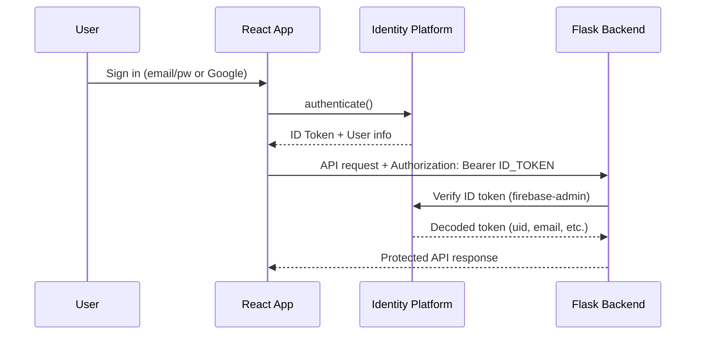
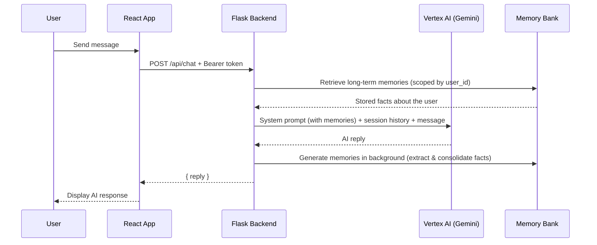

# gcp-training

[](LICENSE)

GCP Training Session

## Goal

By the end of this training session, you will have a fully deployed web app that does the following:

1. User Authentication Flow w/ Identity Platform
2. Personalized Chat Interface w/ Vertex AI + Memory Bank

You will also learn how to do the following with GCP:

1. Setup Github Workflows with Cloud Run
2. Deploy scalable applications with Kubernetes (GKE)
3. Monitoring Logs and DB

## Fork the Repository

To get started, fork this repository on GitHub by clicking the "Fork" button in the top-right corner of the [repository page](https://github.com/hyunjaemoon/gcp-training).
Once you have your own fork, clone it to your local machine:

```bash
git clone https://github.com/YOUR-GITHUB-USERNAME/gcp-training.git
cd gcp-training
```

Be sure to replace `YOUR-GITHUB-USERNAME` with your actual GitHub username.

## Prerequisite

- Create a new GCP project.
- Create a Billing Account for GCP
  - See if you can get [Google Cloud Free Trial](https://docs.cloud.google.com/free/docs/free-cloud-features)
  - If not, create your own Billing Account. This training session will use no more than $1.

## Lesson Plan

### 0. Understand Codebase: Basic Flask Server + React App

**Run the app**

```bash
# Production-style (build UI, serve from Flask)
./run.sh              # then open http://localhost:8080

# Development with hot reload (Flask + Vite)
./dev.sh              # then open http://localhost:5173
```

### 1. Understand gcloud-cli & GCP Console

- [Install gcloud cli](https://docs.cloud.google.com/sdk/docs/install-sdk)

  - `gcloud auth login`
  - `gcloud config set project PROJECT_ID`

### 2. Implement User Authentication Flow



**Firebase Console Setup:**

1. Enable [Identity Platform](https://console.cloud.google.com/security/identity) in your GCP project
2. Go to [Firebase Console](https://console.firebase.google.com) and open (or create) the project linked to your GCP project
3. Navigate to **Authentication** > **Sign-in method** and enable the following providers:
   - **Email/Password**
   - **Google** (select a support email when prompted)
4. Go to **Project Settings** (gear icon) > **General** > **Your apps** and register a **Web app** if you haven't already
5. Copy the Firebase config values (`apiKey`, `authDomain`, `projectId`) and add them to `ui/.env`:
   ```
   VITE_FIREBASE_API_KEY=your-api-key
   VITE_FIREBASE_AUTH_DOMAIN=your-project-id.firebaseapp.com
   VITE_FIREBASE_PROJECT_ID=your-project-id
   ```
6. Go to **Authentication** > **Settings** (gear icon) > **Authorized domains** and ensure your domains are listed:
   - `localhost` — for local development (usually present by default)
   - Your **Cloud Run domain** (e.g. `gcp-training-xxxxx-uc.a.run.app`) — add this after deploying in Step 5; without it, sign-in will fail with `auth/unauthorized-domain`

**Code Changes:**

- Install the `firebase` npm package in `ui/`
- Create `ui/src/firebase.js` to initialize the Firebase app with your project config
- Create `ui/src/AuthContext.jsx` to manage auth state using React Context
- Create `ui/src/Login.jsx` with email/password form and Google sign-in button
- Update `ui/src/App.jsx` to gate content behind auth and pass ID tokens in API requests
- Wrap the app with `AuthProvider` in `ui/src/main.jsx`
- Add `firebase-admin` to `requirements.txt`
- Update `server.py` with a `@require_auth` decorator that verifies ID tokens from the `Authorization` header

**Local Development:**

- Run `gcloud auth application-default login` so the Flask backend's `firebase-admin` SDK can verify ID tokens locally

### 3. Implement a Personalized Chatbot App using Vertex AI + Memory Bank



**GCP Console Setup:**

1. Enable the [Vertex AI API](https://console.cloud.google.com/flows/enableapi?apiid=aiplatform.googleapis.com) in your GCP project
2. Run `gcloud auth application-default login` so the SDK can authenticate locally

**Deploy an Agent Engine Instance (Memory Bank):**

1. Add `google-cloud-aiplatform>=1.111.0` to `requirements.txt`
2. Create `agent.py` with a CLI that deploys a new Agent Engine instance:
   ```bash
   python agent.py deploy
   ```
3. Copy the returned resource name and store it as a constant in `agent.py` (or export it as `AGENT_ENGINE_NAME`)

**Implement the Chat Agent (`agent.py`):**

The `ChatAgent` class uses two layers of memory:

- **Short-term (session) memory**: An in-process Python dict that stores the full conversation history for the current server session. This gives Gemini message-by-message context but is lost on restart.
- **Long-term memory (Memory Bank)**: Vertex AI Agent Engine Memory Bank, a fully managed service that automatically extracts meaningful facts (preferences, personal info, key events) from conversations and persists them across sessions and deployments. Memories are scoped by `user_id` and retrieved via similarity search or scope-based lookup.

On each chat message the agent:

1. **Retrieves** long-term memories from Memory Bank for the user
2. **Injects** those memories into the system prompt so Gemini can personalize its response
3. **Sends** the message along with session history to Gemini
4. **Saves** the exchange in session history
5. **Triggers** background memory generation so Memory Bank can extract and consolidate new facts

**Connect the Routes (`server.py`):**

- `POST /api/chat` — send a message, receive an AI reply (with memory context)
- `GET /api/chat/history` — retrieve the current session's conversation history
- `POST /api/chat/clear` — clear the current session's conversation history

All endpoints are protected by the `@require_auth` decorator from Step 2.

**Update the Frontend (`ui/src/App.jsx`):**

- Replace the welcome message view with a chat interface (message bubbles, input bar, send button)
- Load existing session history on sign-in
- Add a "Clear Chat" button in the header

### 4. Setup Docker Containers

Containerize the app with a multi-stage Dockerfile and `.dockerignore` for lean, reproducible builds.

**Dockerfile (multi-stage build):**

- **Stage 1 (ui-builder):** Node 22 Alpine — installs npm deps, copies `ui/`, injects Firebase build args from `ui/.env`, runs `npm run build`. Output goes to `ui/dist`.
- **Stage 2 (runtime):** Python 3.13 slim — installs `requirements.txt` + gunicorn, copies `server.py`, `agent.py`, and the built UI. Serves on `PORT` (default 8080) with gunicorn (1 worker, 8 threads).

**`.dockerignore`:**

Excludes files from the build context to speed up builds and keep images smaller:

- Version control (`.git`), Python venv, `node_modules`, `ui/dist` (rebuilt in Docker)
- IDE/editor configs (`.vscode`, `.cursor`, etc.)
- `.env` and `ui/.env` — secrets come from runtime env (Cloud Run, Secret Manager)
- Docs and local scripts (`README.md`, `dev.sh`, `run.sh`)

**Cloud Run vs Kubernetes: Choosing a deployment target**

Both Cloud Run (Lesson 5) and GKE (Lesson 6) can deploy your containerized app. They are independent options—you can do either or both. Use this table to decide which path fits your needs:

| Use case | Often better fit |
|----------|------------------|
| Simple APIs, web apps, event handlers | Cloud Run |
| Microservices, complex architectures | GKE |
| Low or spiky traffic, cost-sensitive | Cloud Run |
| Need full control, custom networking | GKE |
| Fast iteration, small team | Cloud Run |
| Large team, many services, advanced tooling | GKE |

### 5. Deploy via Cloud Run

Deploy the containerized app to Cloud Run for a serverless, auto-scaling deployment.

**Deploy:**

```bash
./deploy_cloudrun.sh
```

The script builds the image (with Firebase config), pushes to Artifact Registry, deploys to Cloud Run, and grants public access.

**Firebase Console — Authorized domains (required for sign-in):**

After deployment, add your Cloud Run domain to Firebase so Google/Email sign-in works:

1. Go to [Firebase Console](https://console.firebase.google.com) → your project → **Authentication** > **Settings** > **Authorized domains**
2. Click **Add domain**
3. Enter your Cloud Run hostname (e.g. `gcp-training-xxxxx-uc.a.run.app`)

To get your Cloud Run URL: `gcloud run services describe gcp-training --region=us-central1 --format='value(status.url)'`

### 6. Deploy via Kubernetes (GKE) for Scalable Applications

Deploy the containerized app to Google Kubernetes Engine (GKE) to run a scalable, production-ready workload with automatic scaling and load balancing.

**GCP Console Setup:**

1. Enable the [Kubernetes Engine API](https://console.cloud.google.com/flows/enableapi?apiid=container.googleapis.com) in your GCP project
2. Install `kubectl` (included with `gcloud components install kubectl` or via your package manager)
3. Create a GKE cluster (Autopilot or Standard) in your preferred region

**Concepts to Learn:**

- **Deployments** — Declarative configuration for your app (replicas, image, env vars)
- **Services** — Expose your app internally (ClusterIP) or externally (LoadBalancer)
- **Horizontal Pod Autoscaler (HPA)** — Scale pods based on CPU/memory usage
- **ConfigMaps & Secrets** — Manage configuration and sensitive data (e.g. Firebase config, `GOOGLE_CLOUD_PROJECT`)

**What You Will Implement:**

- Push your Docker image to Google Container Registry (Artifact Registry)
- Write Kubernetes manifests (Deployment, Service, optional HPA)
- Deploy to GKE and verify the app is reachable
- Configure autoscaling so the app scales with traffic

**Local Development:**

- Use `gcloud container clusters get-credentials CLUSTER_NAME --region REGION` to configure `kubectl` for your cluster

## Some Example Web Apps via GCP

- [Python Testing Agent](https://pythontestingagent.com): Python Testing Agent Powered by LLM
- [Hyun Jae Moon Portfolio](https://hyunjaemoon.com): Personal website of Hyun Jae Moon. Includes LLM Chatbot.

## Author

**Hyun Jae Moon** — [calhyunjaemoon@gmail.com](mailto:calhyunjaemoon@gmail.com)

## License

This project is licensed under the [Apache License 2.0](LICENSE).
